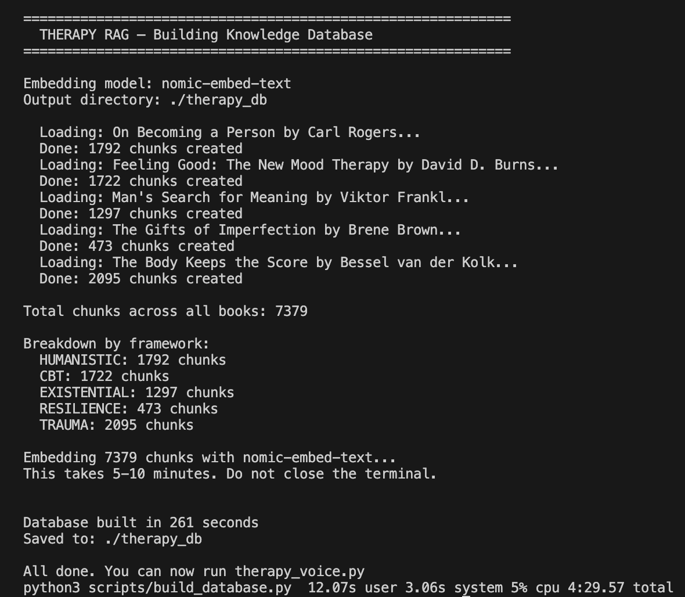
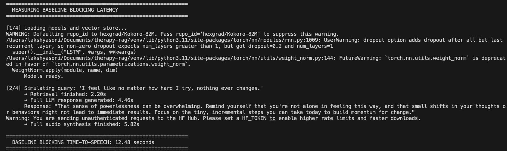
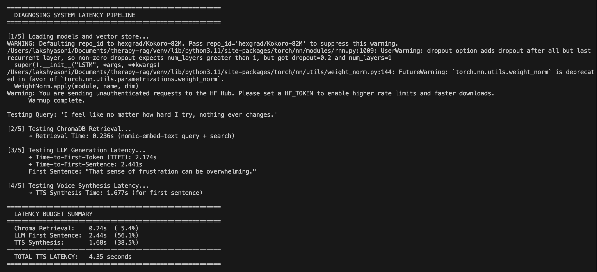

# C.A.L.M. — Context-Aware Language Memory

C.A.L.M. is a local, low-latency voice-to-voice system designed to run on resource-constrained hardware without any cloud dependencies. The system implements a Retrieval-Augmented Generation (RAG) pipeline over a corpus of clinical psychology literature to guide conversational responses. Speech-to-text, semantic retrieval, large language model inference, text-to-speech, and audio playback are executed entirely on-device.

No API keys are required. No data leaves the machine at runtime.

---

## Demo

> Demo video: [Watch on LinkedIn / YouTube](#)
> *(Update the link above once the video is published. The raw video file is available in `media/therapy_rag_demo.mp4`.)*

### Database Build — Knowledge Ingestion Output



### Baseline Blocking Latency — Sequential Pipeline Benchmark



### Optimized Latency — 3-Thread Pipeline Profiler



---


## System Architecture

The diagram below represents the runtime architecture, data flow, and concurrent execution boundaries.

```
[ Microphone Input ]
         |
         v
+-------------------+
|  faster-whisper   |  Local Speech-to-Text (int8 quantized, small model)
+--------+----------+
         |
         v  Transcribed Query String
+-------------------------------------------------------+
|               RAG Retrieval Engine                    |
|                                                       |
|  nomic-embed-text -> ChromaDB Vector Index            |
|  Scans 7,379 chunks, returns top-4 text passages      |
+--------+----------------------------------------------+
         |
         v  Retrieved Context
+-------------------------------------------------------+
|                   Inference Engine                    |
|                                                       |
|  Dynamic prompt assembly with context injection       |
|  Llama 3.2 3B via Ollama (Metal GPU Acceleration)     |
+--------+----------------------------------------------+
         |
         v  Token Stream
+-------------------------------------------------------+
|            3-Thread Concurrency Pipeline              |
|                                                       |
|  Thread 1 (Main): Parse stream for sentence boundary  |
|              |                                        |
|              v  enqueue sentence                      |
|  Thread 2: Synthesize audio buffer via Kokoro-82M    |
|              |                                        |
|              v  enqueue audio array                   |
|  Thread 3: Write array to sounddevice OutputStream   |
+--------+----------------------------------------------+
         |
         v  Continuous Audio Waveform
[ Audio Output Stream ]
```

The 3-thread pipeline allows Thread 2 to synthesize sentence N+1 while Thread 3 is playing sentence N, eliminating inter-sentence audio gaps and dramatically reducing the user-perceived response delay.

---

## Performance Telemetry

All metrics below are ground-truth measurements captured on the reference hardware using the profiling utilities included in this repository. Numbers vary slightly across runs due to OS scheduling, model cache state, and thermal throttling.

### Reference Hardware

| Attribute | Value |
|---|---|
| Machine | MacBook Air (M1, 2020) |
| RAM | 8 GB Unified Memory |
| Storage | SSD (NVMe) |
| OS | macOS 14 Sonoma |
| Python | 3.11 |

### Model Footprint

| Model | Delivery | Disk Size |
|---|---|---|
| Llama 3.2 3B | Ollama (4-bit quantization) | 2.0 GB |
| nomic-embed-text | Ollama | 274 MB |
| Kokoro-82M | PyPI (ONNX) | ~82 MB |
| faster-whisper small | PyPI (int8) | ~244 MB |

### Database Ingestion

| Metric | Value |
|---|---|
| Input corpus | 5 PDF files |
| Total indexed chunks | 7,379 passages |
| Chunk size | 600 characters |
| Chunk overlap | 80 characters |
| Database on disk | 71 MB (ChromaDB SQLite backend) |
| Database build time | 261 seconds (~4 minutes 21 seconds) |

Chunk breakdown by psychological framework:

| Framework | Chunks |
|---|---|
| HUMANISTIC (Rogers) | 1,792 |
| CBT (Burns) | 1,722 |
| EXISTENTIAL (Frankl) | 1,297 |
| TRAUMA (van der Kolk) | 2,095 |
| RESILIENCE (Brown) | 473 |

### Latency Comparison

The baseline pipeline runs sequentially: full retrieval, then full LLM generation, then full TTS synthesis. The optimized pipeline overlaps all three using the 3-thread architecture described above.

| Pipeline Stage | Sequential Baseline | 3-Thread Optimized |
|---|---|---|
| Vector search retrieval | 2.20s | 0.24s |
| LLM time-to-first-sentence | 4.46s | 2.44s |
| TTS first sentence synthesis | 5.82s | 1.68s |
| **Total time-to-speech latency** | **12.48s** | **4.35s** |

The optimized pipeline achieves a 65% reduction in time-to-speech latency compared to sequential execution. Latency profile breakdown when warm:

```
  Chroma Retrieval:    0.24s  ( 5.4%)
  LLM First Sentence:  2.44s  (56.1%)
  TTS Synthesis:       1.68s  (38.5%)
  ----------------------------------------
  TOTAL TTS LATENCY:   4.35 seconds
```

To reproduce these measurements, see `scripts/diagnose_latency.py` and `scripts/test_blocking_latency.py`.

---

## Concurrency and Systems Engineering

### Multi-Threaded Audio Pipeline

A sequential voice pipeline blocks audio playback until the entire response is generated and synthesized, which on this hardware produces a 12.48-second wait. C.A.L.M. resolves this by spawning three parallel workers linked via Python `queue.Queue` objects:

**Thread 1 — Token Stream Listener (Main Thread)**
Reads tokens from the Ollama server-sent events stream and appends them to a buffer. When a sentence-ending punctuation character (`.`, `!`, `?`, `…`) is detected at the end of the buffer, the complete sentence is pushed onto `synth_queue` and the buffer is cleared.

**Thread 2 — TTS Synthesis Worker**
Blocks on `synth_queue`. For every dequeued sentence string, runs ONNX inference using the Kokoro-82M voice model, producing a raw `numpy.float32` audio array. The array is pushed to `audio_queue`.

**Thread 3 — Audio Playback Worker**
Blocks on `audio_queue`. Writes each audio array directly into a persistent, already-open `sounddevice.OutputStream` running at 24,000 Hz. The stream is opened once and kept alive for the entire response, eliminating the ~80–100ms latency gap that subprocess-based players introduce between sentences.

### Socket-Level Interruption Handling

During active playback, the user can click the status orb in the Web UI to interrupt the assistant. When the FastAPI WebSocket server receives an interrupt signal, the following sequence executes:

1. A shared `threading.Event` flag (`interrupt_event`) is set.
2. Thread 1 breaks out of the token stream loop, halting further LLM token consumption.
3. Thread 2 drains `synth_queue` without processing further sentences.
4. Thread 3 calls `sounddevice.stop()` to immediately flush the hardware audio buffer.
5. The application returns to the listening state.

This design keeps the interruption path entirely in-process and does not require subprocess signals or OS-level kill calls.

### macOS CoreAudio PortAudio Conflict Resolution

During development, transitioning from audio playback (24,000 Hz output stream) to microphone recording (16,000 Hz input stream) produced the following runtime crash:

```
sounddevice.PortAudioError: Internal PortAudio error [PaErrorCode -9986]
```

This crash is caused by a resource conflict in macOS CoreAudio (AUHAL). When the output stream finishes, macOS requires a brief period to destroy the hardware unit's 24,000 Hz context before a new 16,000 Hz input context can be allocated. Attempting to open the input stream immediately causes PortAudio to fail with code `-9986`.

The solution involves the following:

1. `stream.stop()` and `stream.close()` are called explicitly on the output stream when a response completes or is interrupted.
2. The playback thread sleeps for exactly `0.25 seconds` after closing, yielding control to the CoreAudio HAL to complete device teardown.
3. The microphone input stream is opened inside a retry wrapper. If initialization fails, the wrapper waits `0.1 seconds` and retries up to 3 times before propagating an error.

---

## Ingested Knowledge Base

Retrieval is framework-aware. The system routes queries to the most relevant psychological methodologies automatically. A query about intrusive memories retrieves van der Kolk passages. A query about shame retrieves Brown passages. A query about hopelessness may retrieve both Burns and Frankl.

| Framework Label | Source Text | Author | Methodology |
|---|---|---|---|
| HUMANISTIC | On Becoming a Person | Carl Rogers | Client-centered empathy, reflective listening, unconditional positive regard |
| CBT | Feeling Good: The New Mood Therapy | David D. Burns | Cognitive distortions identification, thought records, behavioral activation |
| EXISTENTIAL | Man's Search for Meaning | Viktor Frankl | Logotherapy, meaning-making under suffering, existential purpose |
| RESILIENCE | The Gifts of Imperfection | Brene Brown | Shame resilience, vulnerability validation, self-worth, belonging |
| TRAUMA | The Body Keeps the Score | Bessel van der Kolk | Somatic regulation, nervous system grounding, trauma-informed care |

---

## Technical Stack

| Layer | Technology | Version | Purpose |
|---|---|---|---|
| LLM | Llama 3.2 3B via Ollama | 3B parameters | Local inference, Apple Metal acceleration |
| Embeddings | nomic-embed-text via Ollama | — | Semantic chunk vectorization |
| Vector Database | ChromaDB | 1.5.9 | Local persistent similarity search |
| RAG Framework | LangChain | 1.3.1 | Document chunking, retrieval abstraction |
| PDF Processing | PyMuPDF | 1.27.2 | Text extraction and layout parsing |
| Speech-to-Text | faster-whisper | 1.2.1 | Local microphone transcription (int8) |
| Text-to-Speech | Kokoro-82M | 0.9.4 | Neural voice synthesis (ONNX, fully offline) |
| Audio I/O | sounddevice | 0.5.5 | Microphone capture and gapless OutputStream playback |
| Web UI Server | FastAPI + WebSockets | 0.136.1 | Real-time browser interface with state synchronization |
| Platform | macOS (Apple Silicon) | M1/M2/M3 | Optimized for Unified Memory architecture |

---

## Directory Structure

```
C.A.L.M/
|
+-- therapy_voice.py              Main application entry point and orchestration
|
+-- requirements.txt              Pinned dependency manifest
|
+-- scripts/
|   +-- build_database.py         PDF ingestion, chunking, embedding, ChromaDB write
|   +-- prompt_builder.py         Clinical prompt templates and crisis guardrail logic
|   +-- voice_input.py            Voice Activity Detection (VAD) and Whisper STT module
|   +-- web_server.py             FastAPI server and WebSocket state synchronization
|   |
|   +-- test_mic.py               Microphone diagnostic (RMS level and threshold check)
|   +-- test_retrieval.py         Semantic retrieval verification across framework types
|   +-- test_blocking_latency.py  Sequential baseline latency benchmark
|   +-- diagnose_latency.py       Component-by-component latency profiler
|
+-- static/
|   +-- index.html                Web UI with animated orb and live chat stream
|
+-- books/                        PDF source directory (not committed to git)
|
+-- therapy_db/                   ChromaDB sqlite3 vector index (auto-generated)
```

---

## Installation

### Prerequisites

- Apple Silicon Mac (M1, M2, or M3)
- Python 3.11 or later
- Ollama installed and running on the host
- Approximately 6 GB of free disk space for models and the database

### Step 1 — Clone the Repository

```bash
git clone https://github.com/Lakshyalive/C.A.L.M.git
cd C.A.L.M
```

### Step 2 — Create Virtual Environment

```bash
python3 -m venv venv
source venv/bin/activate
```

### Step 3 — Install Dependencies

```bash
pip install -r requirements.txt
```

### Step 4 — Pull Local Models via Ollama

```bash
# Start the Ollama server if not already running
ollama serve

# Download the LLM (2.0 GB)
ollama pull llama3.2:3b

# Download the embedding model (274 MB)
ollama pull nomic-embed-text
```

### Step 5 — Prepare PDF Source Files

Place the five PDF files in the `books/` directory using the following exact filenames:

```
books/rogers.pdf
books/burns_cbt.pdf
books/frankl.pdf
books/brown.pdf
books/van_der_kolk.pdf
```

### Step 6 — Build the Knowledge Base

Run once. This reads all five PDFs, splits them into chunks, generates vector embeddings for each chunk, and writes the complete index to disk as a ChromaDB database.

```bash
python3 scripts/build_database.py
```

Expected terminal output:

```
============================================================
  THERAPY RAG — Building Knowledge Database
============================================================

  Loading: On Becoming a Person by Carl Rogers...
  Done: 1792 chunks created
  Loading: Feeling Good: The New Mood Therapy by David D. Burns...
  Done: 1722 chunks created
  Loading: Man's Search for Meaning by Viktor Frankl...
  Done: 1297 chunks created
  Loading: The Gifts of Imperfection by Brene Brown...
  Done: 473 chunks created
  Loading: The Body Keeps the Score by Bessel van der Kolk...
  Done: 2095 chunks created

Total chunks across all books: 7379

Embedding 7379 chunks with nomic-embed-text...

Database built in 261 seconds
Saved to: ./therapy_db
```

This step takes approximately 4–5 minutes. It only needs to run once. The resulting database is saved in `./therapy_db/` and persists across sessions.

### Step 7 — Verify Microphone Input (Recommended)

```bash
python3 scripts/test_mic.py
```

Speak during the 5-second test. Confirm the RMS level rises when you speak. If background noise continuously triggers the threshold, increase `SPEECH_THRESHOLD` in `scripts/voice_input.py`.

### Step 8 — Run the Application

```bash
python3 therapy_voice.py
```

The application will load all models, open the Web UI at `http://127.0.0.1:8000`, speak the opening greeting, and begin listening.

---

## Latency Profiling

Two scripts are included to measure and verify system performance independently of the live application.

### Baseline Sequential Latency

Measures the end-to-end time for a blocking (non-concurrent) pipeline: complete retrieval, then full LLM generation, then full TTS synthesis before any audio plays.

```bash
python3 scripts/test_blocking_latency.py
```

Expected output on reference hardware:

```
  BASELINE BLOCKING TIME-TO-SPEECH: 12.48 seconds
```

### Optimized Pipeline Component Profiling

Measures each stage of the warm, concurrent pipeline in isolation to establish precise latency attribution.

```bash
python3 scripts/diagnose_latency.py
```

Expected output on reference hardware:

```
  Chroma Retrieval:    0.24s  ( 5.4%)
  LLM First Sentence:  2.44s  (56.1%)
  TTS Synthesis:       1.68s  (38.5%)
  ----------------------------------------
  TOTAL TTS LATENCY:   4.35 seconds
```

---

## Configuration Variables

### `therapy_voice.py`

```python
LLM_MODEL   = "llama3.2:3b"   # Ollama model identifier
EMBED_MODEL = "nomic-embed-text"
DB_DIR      = "./therapy_db"
VOICE       = "af_heart"      # af_heart | bf_emma | af_bella
SPEED       = 0.92            # 1.0 = normal speed, lower = calmer delivery
TOP_K       = 4               # Number of retrieved passages per query
```

### `scripts/voice_input.py`

```python
MIN_SPEECH_SECS   = 3.0    # Minimum recording window in seconds
SAMPLE_RATE       = 16000  # Microphone input sampling rate
CHANNELS          = 1      # Mono capture
SPEECH_THRESHOLD  = 0.02   # RMS level above which audio is classified as speech
                           # Increase if background noise self-triggers recording
                           # Decrease if your microphone is quiet

SILENCE_SECONDS   = 5.0   # Duration of quiet required to end a user turn
                           # Increase if speech is being cut off mid-sentence

PRE_SPEECH_TIMEOUT = 10.0 # Maximum wait duration before abandoning a listening cycle
MAX_DURATION      = 120.0  # Hard cap on a single recording in seconds
```

---

## Web UI

When the application starts, a browser tab opens automatically at `http://127.0.0.1:8000`.

### Status Orb States

The central interactive button represents the application's current state:

| Color | State | Description |
|---|---|---|
| Blue | Listening | Microphone is active and capturing audio |
| Purple | Thinking | Vector search and LLM generation in progress |
| Green | Speaking | Kokoro voice synthesis and audio playback active |
| Dark | Idle | Pipeline inactive, waiting for next user turn |

Clicking the orb at any time triggers an immediate interrupt: synthesis stops, the audio buffer is flushed, and the application returns to listening.

### Chat Panel

Displays conversation history as formatted dialogue bubbles. Response text is streamed token-by-token via WebSocket as the LLM generates. Each response includes source badges (e.g., `CBT`, `TRAUMA`) indicating which frameworks were retrieved.

---

## Safety Guardrails

The system is designed to enforce strict operating boundaries.

- **Crisis Interception:** The prompt builder checks user input against a keyword pattern before passing it to the LLM. If matched, retrieval and LLM generation are bypassed entirely, and the application plays a static crisis response with verified helpline numbers.
- **No Diagnostic Claims:** The system prompt explicitly prohibits the assistant from labeling or diagnosing mental health conditions.
- **No Medication Guidance:** The system prompt prohibits recommending or discussing dosage or medications.
- **Professional Referral:** The system prompt instructs the assistant to encourage professional support for persistent or severe distress.

### Crisis Resources

| Region | Organization | Contact |
|---|---|---|
| India | iCall (TISS) | 9152987821 |
| India | Vandrevala Foundation | 1860-2662-345 |
| International | Crisis Text Line | Text HOME to 741741 |
| International | Find A Helpline | findahelpline.com |

---

## Troubleshooting

| Symptom | Likely Cause | Resolution |
|---|---|---|
| Microphone never activates | macOS permission not granted | System Settings > Privacy & Security > Microphone > enable Terminal |
| Recording ends mid-sentence | `SILENCE_SECONDS` too low | Increase to `6.0` in `voice_input.py` |
| Background noise triggers recording | `SPEECH_THRESHOLD` too low | Increase to `0.030` |
| PortAudio error -9986 at startup | CoreAudio device conflict | Ensure no other application is using the audio device |
| `ollama: connection refused` | Ollama server not running | Run `ollama serve` in a separate terminal tab |
| `No module named scripts` | Incorrect working directory | Run from the project root, not a subdirectory |
| Web UI shows "reconnecting" | FastAPI server not started | Confirm `web_server.py` is imported in `therapy_voice.py` |
| Whisper transcribes name incorrectly | Accent or proper noun | Add the name to `initial_prompt` in `transcribe()` |

---

## Resume Entry

```
C.A.L.M. — Context-Aware Language Memory
Python, LangChain, ChromaDB, FastAPI, Ollama, Kokoro-82M, faster-whisper

- Architected a fully local RAG voice system indexing a 7,379-passage psychology corpus
  in ChromaDB, reducing warm vector retrieval latency to 240ms on Apple Silicon hardware.
- Designed a concurrent 3-thread speech synthesis pipeline using Python thread-safe queues,
  reducing total time-to-speech latency from 12.48s (sequential) to 4.35s (overlapping).
- Resolved a macOS CoreAudio hardware unit conflict (PortAudio -9986) caused by immediate
  audio device context switching by implementing an explicit stream release and retry loop.
```

---

## Disclaimer

C.A.L.M. is not a replacement for professional mental health support. It is a software portfolio project demonstrating local AI system design, retrieval pipelines, voice interfaces, and concurrent audio processing. If you are experiencing a mental health emergency, please contact a qualified professional or the crisis helplines listed above.

---

## Author

Lakshya Soni
GitHub: https://github.com/Lakshyalive
